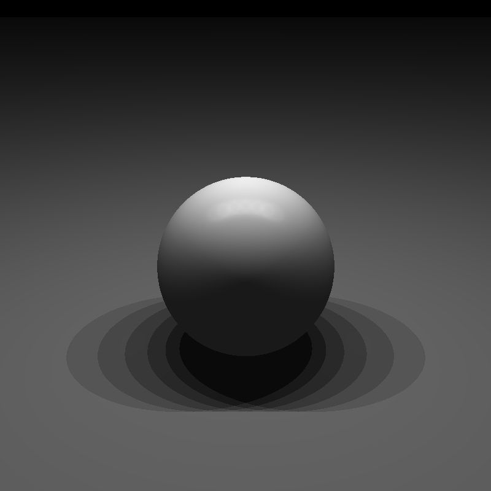
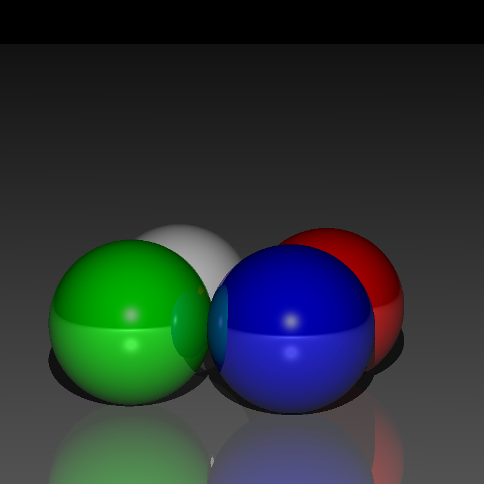
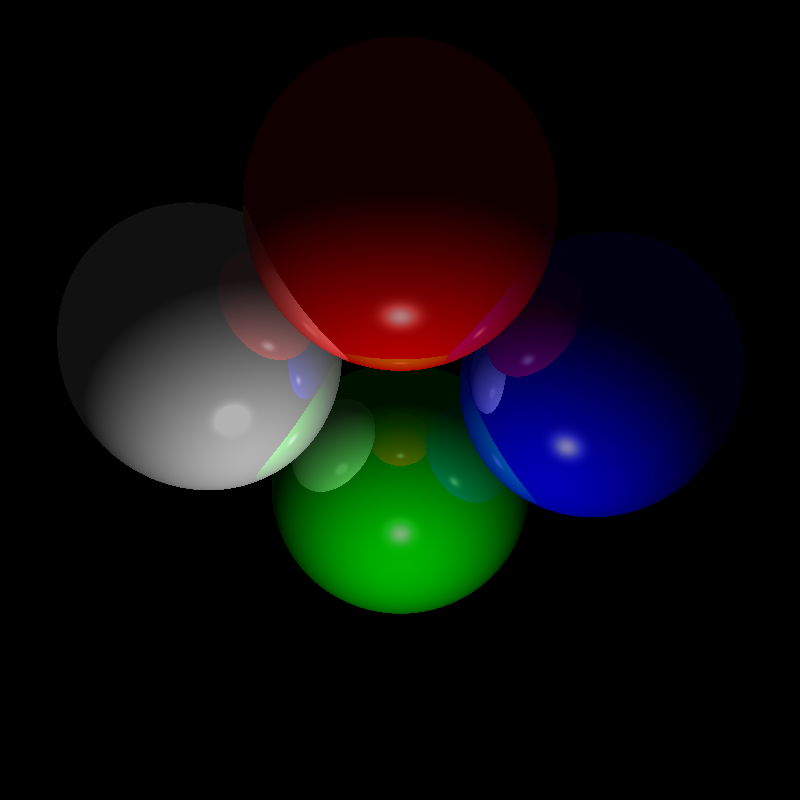
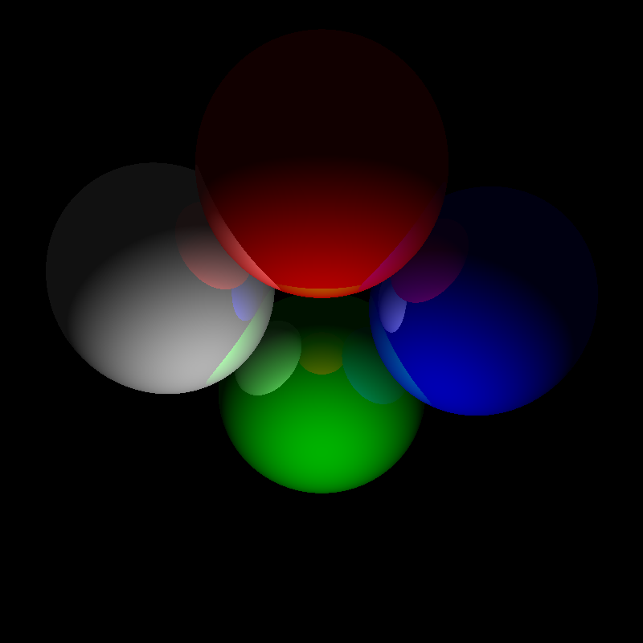
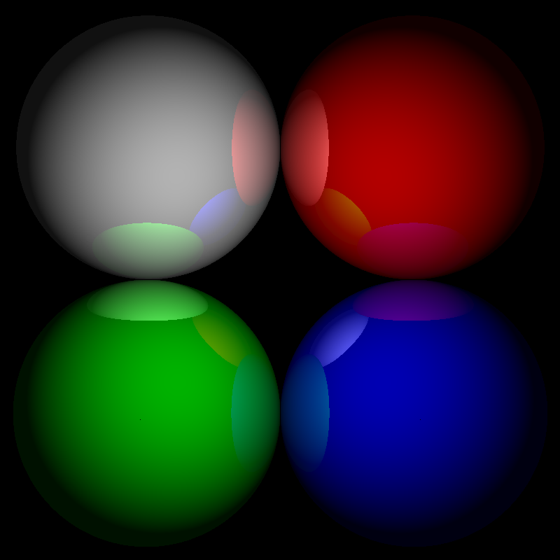
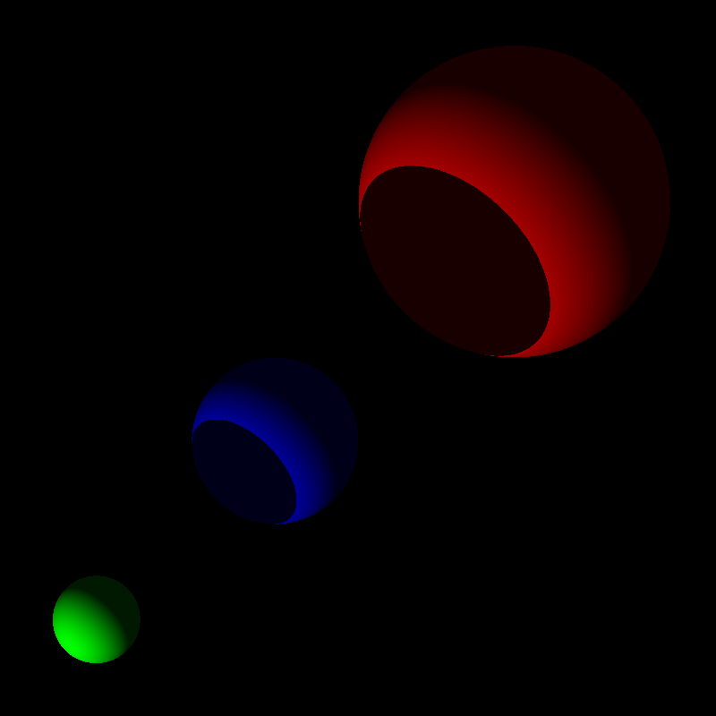

# Raytracer in Scala

Because every developer should do it at least once in his favourite language.

## Progress

* introduced multiple light sources

* * *

* introduced plane as new shape

* * *

* introduced light color
* introduced Phong specular reflection

* * *

* calculating plane position according to camera direction

* * *

* extracted color into material concept and introduced it's reflectiveness
* reflection of objects in respect of reflectiveness factor

* * *

* shade casted between shapes

* * *

* scene described by list of spheres and single light source
* diffused shade on shapes

* * *

* scene described by list of spheres
* adjustable camera position, fixed camera plan
* ambient light only

